## Git分布式版本控制工具

## 1. Git概述

### 1.1 Git历史

Git 诞生于一个极富纷争大举创新的年代。Linux 内核开源项目有着为数众多的参与者。 绝大多数的 Linux 内核维护工作都花在了提交补丁和保存归档的繁琐事务上（1991－2002年间）。 到 2002 年，整个项目组开始启用一个专有的分布式版本控制系统 BitKeeper 来管理和维护代码。

到了 2005 年，开发 BitKeeper 的商业公司同 Linux 内核开源社区的合作关系结束，他们收回了 Linux 内核社区免费使用 BitKeeper 的权力。 这就迫使 Linux 开源社区（特别是 Linux 的缔造者 Linus Torvalds）基于使用 BitKeeper 时的经验教训，开发出自己的版本系统。 

他们对新的系统制订了若干目标：

速度

 简单的设计

 对非线性开发模式的强力支持（允许成千上万个并行开发的分支）

 完全分布式

 有能力高效管理类似 Linux 内核一样的超大规模项目（速度和数据量）

### 1.2 Git与SVN对比

SVN是集中式版本控制系统，版本库是集中放在中央服务器的，而开发人员工作的时候，用的都是自己的电脑，所以首先要从中央服务器下载最新的版本，然后开发，开发完后，需要把自己开发的代码提交到中央服务器。

集中式版本控制工具缺点：

  服务器单点故障

  容错性差


Git是分布式版本控制系统（Distributed Version Control System，简称 DVCS） ，分为两种类型的仓库：

本地仓库和远程仓库

本地仓库：是在开发人员自己电脑上的Git仓库		

远程仓库：是在远程服务器上的Git仓库

Clone：克隆，就是将远程仓库复制到本地

Push：推送，就是将本地仓库代码上传到远程仓库

Pull：拉取，就是将远程仓库代码下载到本地仓库

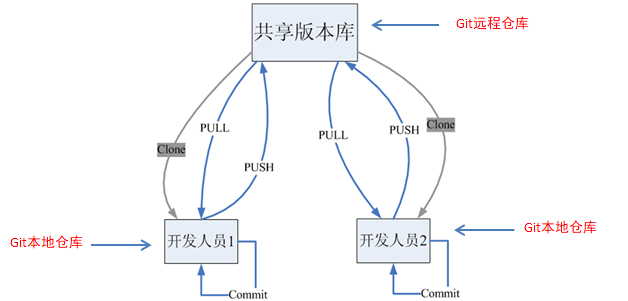

### 1.3 Git工作流程

工作流程如下：

1．从远程仓库中克隆代码到本地仓库

2．从本地仓库中checkout代码然后进行代码修改

3．在提交前先将代码提交到暂存区

4．提交到本地仓库。本地仓库中保存修改的各个历史版本

5．修改完成后，需要和团队成员共享代码时，将代码push到远程仓库


### 1.4 Git下载与安装

下载地址： <https://git-scm.com/download>


下载完成后可以得到如下安装文件：


## 2. Git代码托管服务

### 2.1 常用的Git代码托管服务

前面我们已经知道了Git中存在两种类型的仓库，即本地仓库和远程仓库。那么我们如何搭建Git远程仓库呢？我们可以借助互联网上提供的一些代码托管服务来实现，其中比较常用的有GitHub、码云、GitLab等。

gitHub（ 地址：https://github.com/ ）是一个面向开源及私有软件项目的托管平台，因为只支持Git 作为唯一的版本库格式进行托管，故名gitHub

码云（地址： https://gitee.com/ ）是国内的一个代码托管平台，由于服务器在国内，所以相比于GitHub，码云速度会更快

GitLab （地址： https://about.gitlab.com/ ）是一个用于仓库管理系统的开源项目，使用Git作为代码管理工具，并在此基础上搭建起来的web服务

### 2.2 在码云注册账号

要想使用码云的相关服务，需要注册账号（地址： https://gitee.com/signup ）

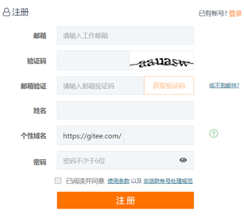

### 2.3 登录码云并创建Git远程仓库

注册完成后就可以使用刚刚注册的邮箱进行登录（地址： https://gitee.com/login ）

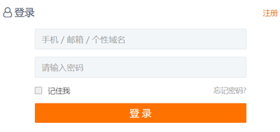

登录成功后就可以创建Git远程仓库


创建完成后可以查看仓库信息

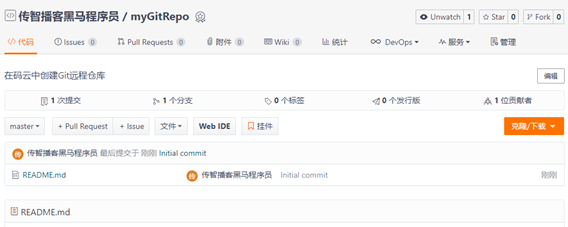

每个Git远程仓库都会对应一个网络地址，可以点击克隆/下载按钮弹出窗口并点击复制按钮获得这个网络地址


我们当前创建的Git远程仓库对应的地址为：https://gitee.com/ChuanZhiBoKe/myGitRepo.git

### 2.4 邀请其他用户成为仓库成员

前面已经在码云上创建了自己的远程仓库，目前仓库成员只有自己一个人（身份为管理员）。在企业实际开发中，一个项目往往是由多个人共同开发完成的，为了使多个参与者都有权限操作远程仓库，就需要邀请其他项目参与者成为当前仓库的成员。


## 3. Git常用命令

### 3.1 环境配置

当安装Git后首先要做的事情是设置用户名称和email地址。这是非常重要的，因为每次Git提交都会使用该用户信息

设置用户信息 

   git config --global user.name “itcast”

   git config --global user.email “hello@itcast.cn”

查看配置信息

   git config --list

   git config user.name

通过上面的命令设置的信息会保存在~/.gitconfig文件中

### 3.2 获取Git仓库

要使用Git对我们的代码进行版本控制，首先需要获得Git仓库

获取Git仓库通常有两种方式：

  在本地初始化一个Git仓库

  从远程仓库克隆

#### 3.2.1在本地初始化一个Git仓库

执行步骤如下：

1. 在电脑的任意位置创建一个空目录（例如repo1）作为我们的本地Git仓库

2. 进入这个目录中，点击右键打开Git bash窗口

3. 执行命令git init

如果在当前目录中看到.git文件夹（此文件夹为隐藏文件夹）则说明Git仓库创建成功


#### 3.2.2从远程仓库克隆

可以通过Git提供的命令从远程仓库进行克隆，将远程仓库克隆到本地

命令形式为：git clone 远程Git仓库地址 


### 3.3工作目录、暂存区以及版本库概念

为了更好的学习Git，我们需要了解Git相关的一些概念，这些概念在后面的学习中会经常提到

版本库：前面看到的.git隐藏文件夹就是版本库，版本库中存储了很多配置信息、日志信息和文件版本信息等

工作目录（工作区）：包含.git文件夹的目录就是工作目录，主要用于存放开发的代码

暂存区：.git文件夹中有很多文件，其中有一个index文件就是暂存区，也可以叫做stage。暂存区是一个临时保存修改文件的地方


### 3.4 Git工作目录下文件的两种状态

Git工作目录下的文件存在两种状态：

  untracked 未跟踪（未被纳入版本控制）

  tracked 已跟踪（被纳入版本控制）

​        Unmodified 未修改状态

​        Modified 已修改状态

​        Staged 已暂存状态

这些文件的状态会随着我们执行Git的命令发生变化

### 3.5 本地仓库操作

git status 查看文件状态

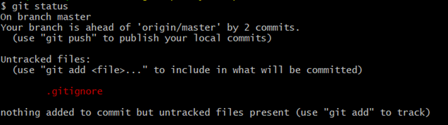

也可以使用git status –s 使输出信息更加简洁

​                                           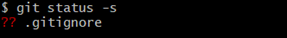

git add 将未跟踪的文件加入暂存区

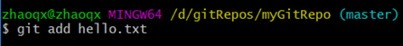

将新创建的文件加入暂存区后查看文件状态


git reset 将暂存区的文件取消暂存

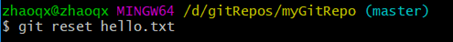

将文件取消暂存后查看文件状态

​	

git commit 将暂存区的文件修改提交到本地仓库


git rm 删除文件

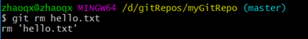

删除文件后查看文件状态

                                                

上面删除的只是工作区的文件，需要提交到本地仓库

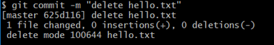

#### **将文件添加至忽略列表**

一般我们总会有些文件无需纳入Git 的管理，也不希望它们总出现在未跟踪文件列表。 通常都是些自动生成的文件，比如日志文件，或者编译过程中创建的临时文件等。 在这种情况下，我们可以在工作目录中创建一个名为 .gitignore 的文件（文件名称固定），输入`touch .gitignore`,生成文件.列出要忽略的文件模式。下面是一个示例：

```
# no .a files
*.a
# but do track lib.a, even though you're ignoring .a files above
!lib.a
# only ignore the TODO file in the current directory, not subdir/TODO
/TODO
# ignore all files in the build/ directory
/build/
# ignore doc/notes.txt, but not doc/server/arch.txt
doc/*.txt
# ignore all .pdf files in the doc/ directory
doc/**/*.pdf
```

git log 查看日志记录

​                                 

### 3.6 远程仓库操作

前面执行的命令操作都是针对的本地仓库，本章节我们会学习关于远程仓库的一些操作，具体包括：

####   3.6.1查看远程仓库

如果想查看已经配置的远程仓库服务器，可以运行 git remote 命令。 它会列出指定的每一个远程服务器的简写。 如果已经克隆了远程仓库，那么至少应该能看到 origin ，这是 Git 克隆的仓库服务器的默认名字

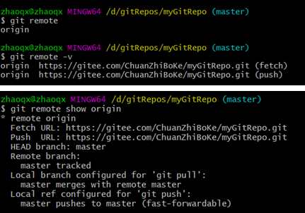

####   3.6.2 添加远程仓库

运行 git remote add <shortname> <url> 添加一个新的远程 Git 仓库，同时指定一个可以引用的简写

​                              

####   3.6.3 从远程仓库克隆

如果你想获得一份已经存在了的 Git 仓库的拷贝，这时就要用到 git clone 命令。 Git 克隆的是该 Git 仓库服务器上的几乎所有数据（包括日志信息、历史记录等），而不仅仅是复制工作所需要的文件。 当你执行 git clone 命令的时候，默认配置下远程 Git 仓库中的每一个文件的每一个版本都将被拉取下来。

克隆仓库的命令格式是 git clone [url] 

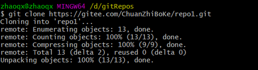

####   3.6.4 移除无效的远程仓库

https://gitee.com/nirvanaruil/repo1.git

如果因为一些原因想要移除一个远程仓库 ，可以使用 git remote rm


注意：此命令只是从本地移除远程仓库的记录，并不会真正影响到远程仓库

####   3.6.5 从远程仓库中抓取与拉取 

git fetch 是从远程仓库获取最新版本到本地仓库，不会自动merge


git pull 是从远程仓库获取最新版本并merge到本地仓库


注意：如果当前本地仓库不是从远程仓库克隆，而是本地创建的仓库，并且仓库中存在文件，此时再从远程仓库拉取文件的时候会报错（fatal: refusing to merge unrelated histories ），解决此问题可以在git pull命令后加入参数--allow-unrelated-histories

####   3.6.6 推送到远程仓库 

当你想分享你的代码时，可以将其推送到远程仓库。 命令形式：git git push [remote-name][branch-name]


### 3.7 Git分支

几乎所有的版本控制系统都以某种形式支持分支。 使用分支意味着你可以把你的工作从开发主线上分离开来，以免影响开发主线。Git 的master分支并不是一个特殊分支。 它跟其它分支没有区别。 之所以几乎每一个仓库都有 master 分支，是因为git init 命令默认创建它，并且大多数人都懒得去改动它。

在本章节我们会学习到关于分支的相关命令，具体如下：

#### 3.7.1 查看分支 

\# 列出所有本地分支

$ git branch

\# 列出所有远程分支

$ git branch -r

\# 列出所有本地分支和远程分支

$ git branch -a

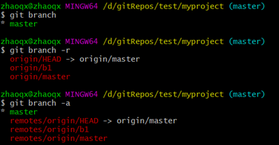

#### 3.7.2 创建分支

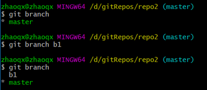

#### 3.7.3 切换分支 


​	

#### 3.7.4 推送至远程仓库分支 

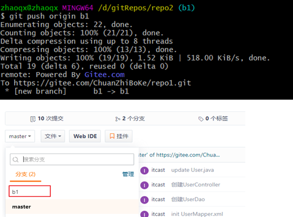

#### 3.7.5 合并分支 


有时候合并操作不会如此顺利。 如果你在两个不同的分支中，对同一个文件的同一个部分进行了不同的修改，Git 就没办法合并它们，同时会提示文件冲突。此时需要我们打开冲突的文件并修复冲突内容，最后执行git add命令来标识冲突已解决


#### 3.7.5 删除分支

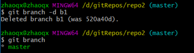

如果要删除的分支中进行了一些开发动作，此时执行上面的删除命令并不会删除分支，如果坚持要删除此分支，可以将命令中的-d参数改为-D

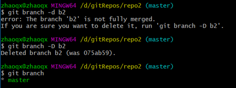

注：如果要删除远程仓库中的分支，可以使用命令git push
origin –d branchName

## 4. 在IDEA中使用Git 

### 4.1 在IDEA中配置Git 

安装好IntelliJ IDEA后，如果Git安装在默认路径下，那么idea会自动找到git的位置，如果更改了Git的安装位置则需要手动配置下Git的路径。

选择File→Settings打开设置窗口，找到Version Control下的git选项：


选择git的安装目录后可以点击“Test”按钮测试是否正确配置

​                       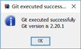

### 4.2 在IDEA中使用Git

#### 4.2.1在IDEA中创建工程并将工程添加至Git 


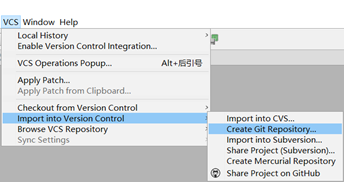

​                                  将项目添加至Git管理后，可以从IDEA的工具栏上看到Git操作的按钮

#### 4.2.2 将文件添加到暂存区


#### 4.2.3 提交文件 


#### 4.2.4 将代码推送到远程仓库 

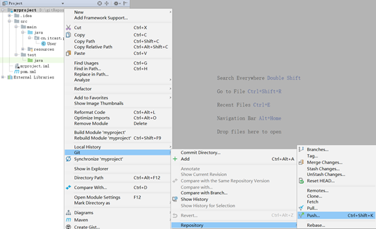

#### 4.2.5 从远程仓库克隆工程到本地


#### 4.2.6 从远程拉取代码


#### 4.2.7 版本对比


#### 4.2.8 创建分支 

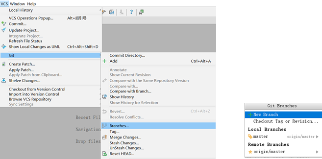

#### 4.2.9 切换分支

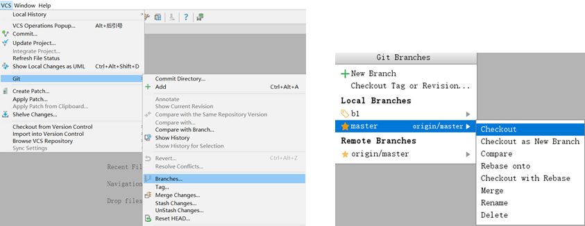

#### 4.2.10 分支合并


## 


#  我的git笔记

## 基本操作

```cmd
入门的一些操作
-----------------------------------
user.name=Kerwin Lin
user.email=kerwinlin@foxmail.com

https://gitee.com/affirmatives/hello.git

git add  文件名 加到暂存区 状态变为被追踪
git reset 文件名 从暂存区取消

$ git commit -m "init hello.txt" 后面是增加的描述
$ git rm hello.txt.txt  删除了工作区的这个文件, 本地仓库这个文件还是存在的

$ touch .gitignore  创建忽略管理文件

$ git log  查看操作日志

-----------------------------------

```

## 退出vim编辑器

:wq i

## 远程操作

```cmd
远程的一些操作
------------------
Lin@DESKTOP-S58MN8I MINGW64 /f/GitRepos/hello (master)
$ git remote
origin

Lin@DESKTOP-S58MN8I MINGW64 /f/GitRepos/hello (master)
$ git remote -v
origin  https://gitee.com/affirmatives/hello.git (fetch)
origin  https://gitee.com/affirmatives/hello.git (push)

Lin@DESKTOP-S58MN8I MINGW64 /f/GitRepos/hello (master)
$ git remote show origin
显示更具体的远程分支信息
------------------------------
如下操作 给本地仓库 添加远程关联仓库  可以添加多个
Lin@DESKTOP-S58MN8I MINGW64 /f/GitRepos/repo1 (master)
$ git remote

Lin@DESKTOP-S58MN8I MINGW64 /f/GitRepos/repo1 (master)
$ git remote add origin https://gitee.com/affirmatives/repo1.git

Lin@DESKTOP-S58MN8I MINGW64 /f/GitRepos/repo1 (master)
$ git remote -v
origin  https://gitee.com/affirmatives/repo1.git (fetch)
origin  https://gitee.com/affirmatives/repo1.git (push)
-------------------
移除和远程仓库的关联

Lin@DESKTOP-S58MN8I MINGW64 /f/GitRepos/repo1 (master)
$ git remote
myremote
origin

Lin@DESKTOP-S58MN8I MINGW64 /f/GitRepos/repo1 (master)
$ git remote rm myremote

Lin@DESKTOP-S58MN8I MINGW64 /f/GitRepos/repo1 (master)
$ git remote
origin
--------------------


```


## 抓取与拉取

```cmd
git fetch 是从远程仓库获取最新版本到本地仓库 不会自动merge(合并数据)
git pull 是从远程仓库获取最新版本 并merge到本地仓库(自动合并)
-----
Lin@DESKTOP-S58MN8I MINGW64 /f/GitRepos/world (master)
$ git fetch origin master 后面这两个可以不写, 也可以写上指明要抓取的分支
这个执行之后,并不会自动合并到工作区中来, 此时文件是不显示的, 放在隐藏文件objects里

手动合并
$ git merge origin/master
执行完之后, 文件就出来咯
------
pull命令 相当于上面两个命令的合
$ git pull origin master

#如果当前本地仓库不是从远程仓库克隆，而是本地创建的仓库，并且仓库中存在文件，此时再从远程仓库拉取文件的时候会报错
（fatal: refusing to merge unrelated histories ），
解决此问题可以在git pull命令后加入参数--allow-unrelated-histories


```


## 推送到远程仓库

```cmd
add commit之后

$ git push origin master
推送代码到远程仓库,需要输入账号密码 

修改本地代码之后,原本需要add到缓存区,然后再提交到本地仓库,如下操作可以合并为一步完成
$ git commit -a -m '修改了xml文件'

```

## 分支

```cmd
$ git branch
* master
查看本地分支

$ git branch -r
  origin/master
查看远程分支

$ git branch -a
查看所有
-----------
$ git branch b1
创建一个名为b1的本地分支,不能重复
---
切换分支
Lin@DESKTOP-S58MN8I MINGW64 /f/GitRepos/world (master)
$ git checkout b1
Switched to branch 'b1'

Lin@DESKTOP-S58MN8I MINGW64 /f/GitRepos/world (b1)
------
把本地分支b1推送到远程仓库
$ git push origin b1
-----
Lin@DESKTOP-S58MN8I MINGW64 /f/GitRepos/world (master)
$ git merge b1
把b1分支合并到master分支, 需要在master分支下操作

注意! 合并有冲突的文件
Lin@DESKTOP-S58MN8I MINGW64 /f/GitRepos/world (master)
$ git merge b1
Auto-merging b1.java
CONFLICT (content): Merge conflict in b1.java 这里会报冲突
Automatic merge failed; fix conflicts and then commit the result.
需要手动修改之后重新add commit 然后就正常了
Lin@DESKTOP-S58MN8I MINGW64 /f/GitRepos/world (master|MERGING)
$ git add b1.java

Lin@DESKTOP-S58MN8I MINGW64 /f/GitRepos/world (master|MERGING)
$ git commit
[master a87b9fd] Merge branch 'b1'


------
把本地仓库的代码推送到远程仓库, 可以在a分支下推送b分支, 只要推送语句写清楚即可;
$ git push origin master
Lin@DESKTOP-S58MN8I MINGW64 /f/GitRepos/world (master)
$ git push origin b1
------
删除分支 删除分支之前必须先合并掉 -D是强制删除
$ git branch -d b2

注意! 如果本地文件和远程仓库的不同, 修改之后提交到了本地仓库, 但是没有推送,此时删除本地分支会报错,没推送不就等于白做了吗
$ git branch -d b1
error: The branch 'b1' is not fully merged.
If you are sure you want to delete it, run 'git branch -D b1'.
坚持要删除 用git branch -D b1指令   一般不建议这么做
-----
删除远程分支
$ git push origin -d b2


```


